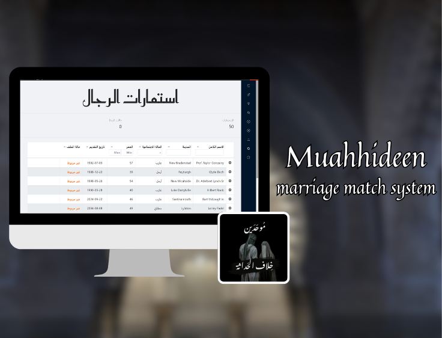
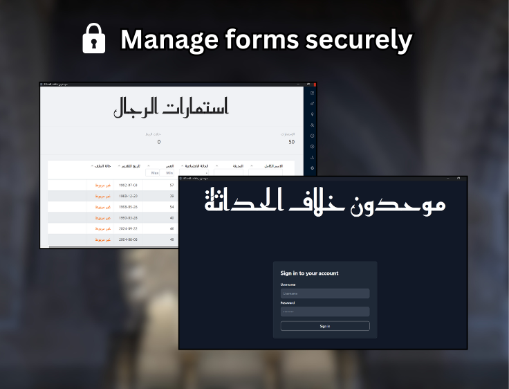
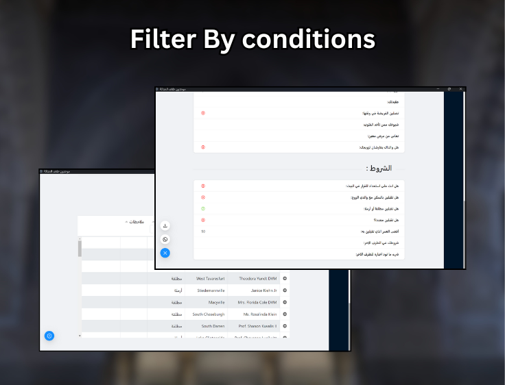
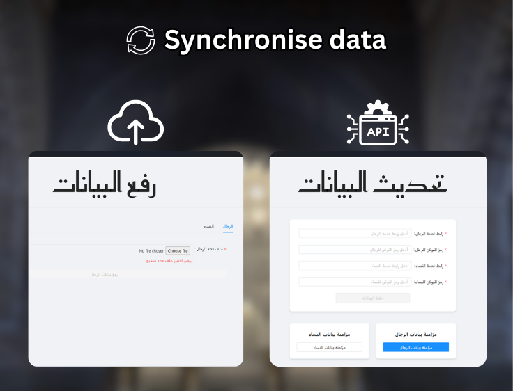

# 💍 Marriage Match System

**Description:**  
A desktop application to manage and match marriage candidates efficiently.

Developed with **PHPNative** (a new Laravel-based desktop framework) and **SQLite**, this system helps a local team process and match marriage requests.  
It allows staff to filter potential partners based on personalized preferences and compatibility criteria, ensuring only suitable matches are proposed.

I also created an **automated migration script** that imports candidate form entries directly from **Google Sheets** into the SQLite database, eliminating manual data entry.

---

## 🖼️ Preview

|  |  |
|-------------------------------------------|----------------------------------------|
|    |  |

---

## 🧠 Technologies Used

| Technology | Description |
|-------------|--------------|
| 🟪 PHPNative | Desktop framework based on Laravel |
| 🅰️ Angular | Front-end framework with TypeScript |
| 💾 SQLite | Lightweight local database |
| 🎨 Tailwind CSS | Styling and responsive layout |
| 🧩 Ant Design | UI components and interface structure |

<h2>⚙️ Installation</h2>

<h3>Development Setup</h3>

```bash
git clone https://github.com/AdamKourchi/Muahhideen.git
cd Muahhideen
composer i
php artisan migrate:fresh
php artisan native:serve
